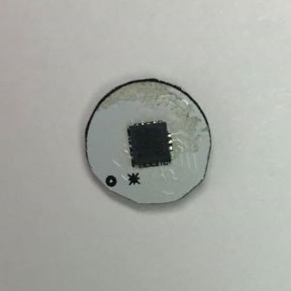

3DA
===

The LIS331DLH is an ultra low-power
high performance three axes linear accelerometer
with digital I2C/SPI serial interface standard output.

**Key Features**

- Embedded self-test
-	6D orientation detection
-	10000 g high shock survivability
-	2 independent programmable interrupt generators for free-fall and motion detection
-	16 bit data output
-	Wide supply voltage, 2.16 V to 3.6 V
-	Ultra low-power mode consumption down to 10 μA
-	Low voltage compatible IOs, 1.8 V
-	I2C/SPI digital output interface
-	Sleep to wake-up function
-	±2g/±4g/±8g dynamically selectable full-scale
-	Output data rates from 0.5 Hz to 1 kHz.
-	Extended temperature range from -40 °C to +85 °C.
