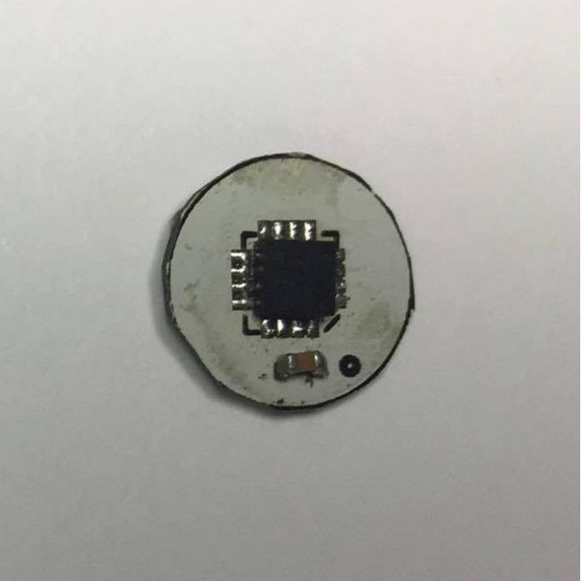

3DG
===

The L3GD20 is a low-power three-axis angular rate sensor.

**Key Features**

-	Three selectable full scales (250/500/2000 dps)
-	User-selectable bandwidth
-	I2 C/SPI digital output interface
-	16 bit-rate value data output
-	8-bit temperature data output
-	Two digital output lines (interrupt and data ready)
-	Integrated low- and high-pass filters with user-selectable bandwidth
-	Wide supply voltage: 2.4 V to 3.6 V
-	Low voltage-compatible IOs (1.8 V)
-	Embedded power-down and sleep mode
-	Embedded temperature sensor
-	Embedded FIFO
-	High shock survivability
-	Extended operating temperature range (-40 °C to +85 °C)
