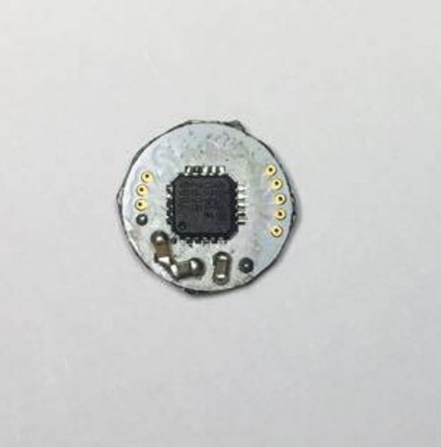

8ADC
====

The AD7689 is an 8-channel, 16-bit, charge
redistribution successive approximation register (SAR)
analog to-digital converter
that operates from a single power supply, VDD.

**Key Features**

-	16-bit resolution with no missing codes
-	8-channel multiplexer with choice of inputs
-	Simple SPI interface uses a separate supply, VIO, which is set to the host logic level
-	Unipolar single-ended
-	Differential (GND sense)
-	Pseudobipolar
-	Throughput: 250 kSPS
-	INL: ±0.4 LSB typical, ±1.5 LSB maximum (±23 ppm or FSR)
-	Dynamic range: 93.8 dB
-	SINAD: 92.5 dB at 20 kHz
-	THD: −100 dB at 20 kHz
-	Analog input range: 0 V to VREF with VREF up to VDD
-	Internal low drift reference (selectable 2.5 V or 4.096 V) and buffer
-	Temperature sensor
-	Extended temperature range from -40 °C to +85 °C.
