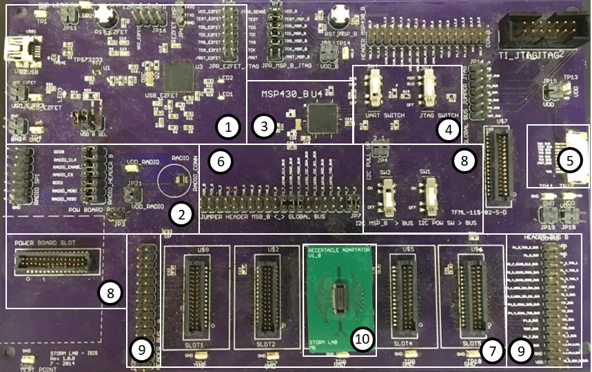

Debugger Guide
==============

1. EX-FET
#. Radio Communication
#. MSP430 MCU
#. Switches SW3, SW4
#. Flexible Circuit Bus
#. Jumper Header Between MSP and Global Bus
#. Global Bus
#. Power Board

There are three different possibilities for
downloading a program to an MSP430 MCU:

- Using the MCU on the board (3),
- Using an MCU attached to the flexible band and connected to the board via the Flex Band Connector (5),
- Using an MCU connected to slot 3 of the Global Bus (7).

To differentiate which MCU to use, the switches in (4),
and the headers in (6) must be configured correctly.
To use the board’s MCU (3), the switches SW3 and SW4 must
be switched to MSP mode. Jumpers are connected across the pins
in (6) to connect the board’s MCU (3) to the sensors and
actuators from the Global Bus. It is important to remember
that when using the board’s MCU, there mustn’t be an MCU
module in slot C of the Global Bus, as this will cause
communication errors. If an MCU module is the desired target,
the switches SW3 and SW4 must be switched to BUS mode, and
an MCU module must be connected via the flexible band in (5)
or in the Global Bus (7). NOT BOTH. The MCU on the board (3)
can’t access the sensors or
actuators when they are on the flexible band. 
