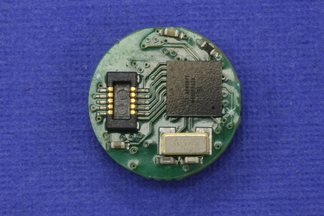
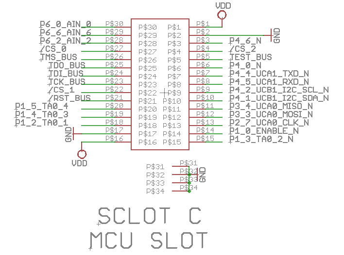

MCU Module
==========

The IC for the MCU Module is the MSP430, which is a 16-Bit Ultra-Low-Power Microcontroller.
The MCU handles local computation, sensor management
and other housekeeping tasks of the MCR. It must be
small enough in size to be embedded into the capsule,
and must operate in low-power modes to maximize the
lifetime of the device, with built-in support for directly
interfacing with various sensors,
actuators and wireless transceivers

The following is the EAGLE schematic of the MCU showing the
capabilities of each of the 30 pins:

The pins listed here represent the pins of the 30-pin minature
connector on the bottom side of the module:

**Digital GPIO**

- Pins 3, 6-15, 18-20, 28-30

**Digital GPIO w/ reconfigurable port mapping**

- Pins 3, 6-10

**Digital GPIO w/ interrupt capabilities**

- Pins 13, 15, 18-20

**Analog input pins**

- Pins 28-30

**SPI mode pins**

- Three chip select pins

  - Pin 4: CS2, connects to slot B on flexible circuit
  - Pin 22: CS1, connects to slot E
  - Pin 27: CS0, connects to slot D

- Pin 11: MISO
- Pin 12: MOSI
- Pin 13: Clock

**I2C mode pins**

- Pin 9: Clock pin
- Pin 10: Data pin

**UART mode pins**

- Pin 7: Transmit
- Pin 8: Receive

**Timer Pins**

- Four Timer A0 pins

  - Pins 15, 18-20
  - 5 capture/compare registers

**JTAG Pins**

- Pins 21-25
