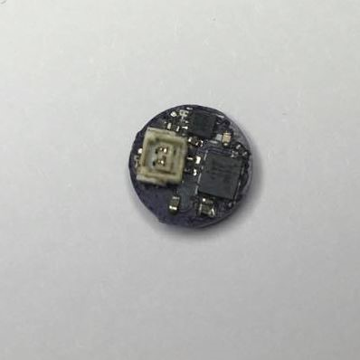

.. _Power Management Module:

Power Module
============

The IC of the Power Management Module is the
LTC2942. The module measures battery charge state, battery
voltage and chip temperature in handheld PC and portable
product applications. The power management module has I2C connectivity
with the MCU for monitoring the state of the battery.
The module provides
regulated power from the battery to the rest
of the hardware modules. This module integrates
a Low Drop-Out (LDO) to supply a single fixed 3.3 V power rail.
