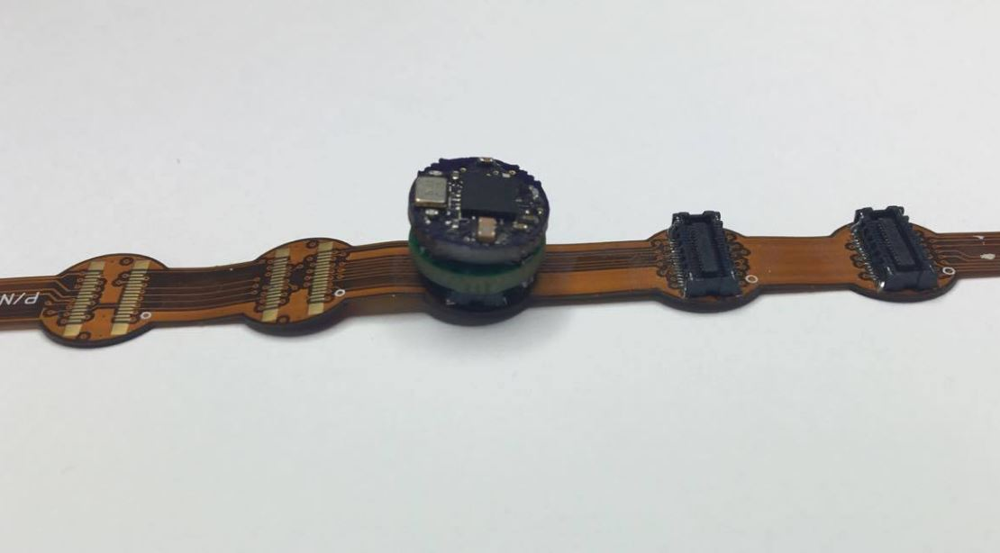

Wireless Module
===============

The IC of the Wireless Module is the CC2650, which is a wireless MCU that consists of a 2.4 GHz radio and
a high-performance ARM CPU.

Many MCR applications require a wireless
communication channel for transmitting information
from inside the human body. This communication must
often be performed with relatively high data rates
for real-time applications with transmission power
bound to medically safe limits. Sub 1 GHz carriers
with lower energy absorption rates in human
tissues are the most suitable for medical devices.
