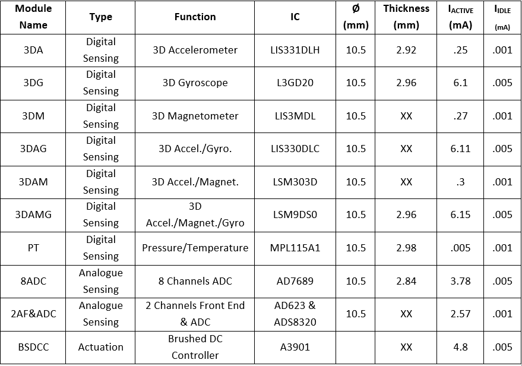
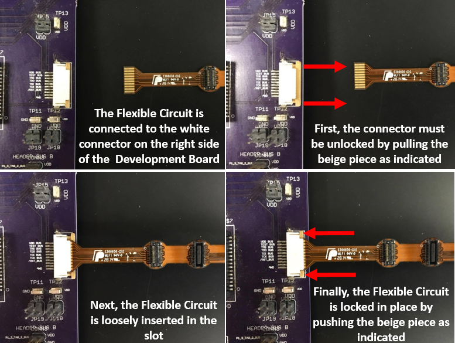

Welcome to the Vanderbilt University STORM Lab MCR Developer's Guide!
=====================================================================
The goal of the STORM Lab's Medical Capsule Robot (MCR) project is to systematize
the development of miniaturized wireless
devices by creating a cyber-physical
design environment that will eliminate
barriers in the design process,
thus accelerating the progress
to prototyping.

This guide is for developers who wish
to use Vanderbilt's modular architecture
for their own project.

What you'll need
^^^^^^^^^^^^^^^^
- A Development Board
- An MCU module
- A wireless module
- Sensor and actuator modules as needed
- A Flexible Circuit
- An environment to write pure TinyOS applications, or Vanderbilt's WebGME environment

**Step 1:** Getting started
---------------------------

Although the initial development for this project
was focused around medical devices, the platform
can be utilized for any project that necessitates
rapid prototyping of a small,
lightweight wireless system of sensors and actuators.

Connectivity between the sensor and actuator
modules is achieved with a :ref:`Flexible Circuit`
on which the modules are mounted
before being folded to form the body of the MCR.

The backbone can host up to five different modules
using 30-pin miniature connectors.
The developer must keep in mind that the center slot
is reserved for the :ref:`MCU module`,
and one slot is reserved
for the :ref:`Power Management Module`.
This leaves three modules available for sensors and actuators.

**Step 2:** Choose modules
--------------------------

There are currently 9 existing sensing modules
and 1 existing actuation module for the MCR:

If your project requires a sensor or actuator that has not
currently been developed for this platform, please
refer to the :ref:`Module Design Guide`
for important information.

**Step 3:** Write code
----------------------

Just as the component-based approach on the hardware
side is beneficial, we have developed a design environment
utilizing TinyOS, which is a component-based operating
system for wireless sensor networks and embedded devices.
To program the MCU, you can either create your own application
with TinyOS, or utilize the graphical
design environment currently in development.

To get started writing a TinyOS application, follow the TinyOS
:ref:`Installation Guide <Installation Guide>` for Ubuntu.

**Step 4:** Test and debug code
-------------------------------

To test, debug, and eventually implement the code,
there exists a Development Board with all of the
functionalities of the flexible circuit, including
an identical MCU and the same wireless capabilities.
Refer to the :ref:`Development Guide` for more information on
the board layout and functions.

We have developed a TinyOS platform called VUMCR that will serve as the
make target for the application. For support with using the Development Board
to port TinyOS, see the :ref:`VUMCR Platform Support`

**Step 5:** Install application on the flexible circuit
-------------------------------------------------------

When the modules have all been tested and debugged
on the Development Board, they must be attached to the
30-pin miniature connectors on the flex band. There is a small black
circle on each module that must be aligned with the small white
circle located on each slot of the Flexible Circuit. REMEMBER,
slot A is designated for the :ref:`Power Management Module`, slot C
is designated for the MCU, and the :ref:`Wireless Module`
is docked
on top of the MCU. The band must then be plugged
into the Development Board and the application must be installed
to the MCU on the flexible circuit. The following shows the proper
way to attach the flexible circuit to the Development board:

Once the application has been installed, the band can be folded
to fit into a smaller space.
To most efficiently compress the band,
follow the folding guide. NOTE: the largest gap between
modules is between slots B and C, and the smallest gap is
between C and D. This should help you with the initial
orientation of the band.

Modules
^^^^^^^
.. _Module Ref:

.. toctree::
   :maxdepth: 2

   MCU
   Wireless
   Power_Module
   Module_Guide

Links
^^^^^

.. toctree::
   :maxdepth: 2

   Debugger_Guide
   Flexible_Circuit
   Module_Design
   Install_on_Ubuntu
   EXP_Support

Indices and tables
^^^^^^^^^^^^^^^^^^

* :ref:`genindex`
* :ref:`modindex`
* :ref:`search`
